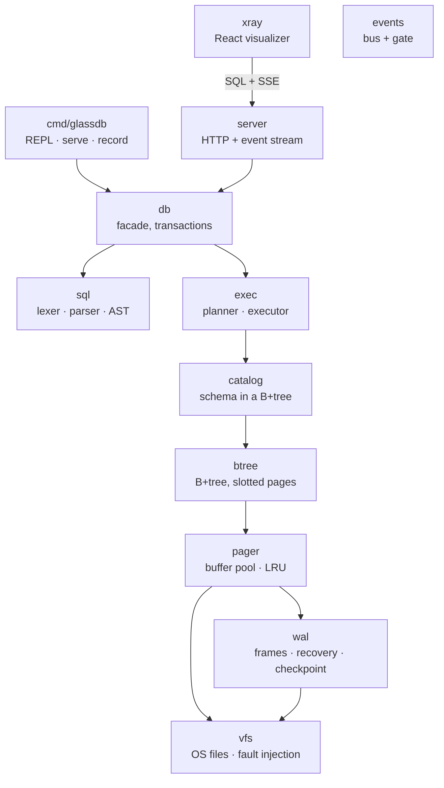

# glassdb

**A small database you can see inside.**

glassdb is a real embedded SQL database written from scratch in Go — fixed-size
pages, a B+tree per table and index, a write-ahead log with crash recovery, an
LRU buffer pool, a SQL parser, and a rule-based query planner. Zero
dependencies, one binary.

What makes it different: **every internal action is emitted as a structured
event**. Page reads. B+tree splits. WAL appends and commit markers. Cache
evictions. Recovery replaying frames after a crash. A web X-ray attaches to
the running engine and animates all of it live — or replays a recorded trace.

Databases stop being magic the first time you *watch* a page split.

```
glassdb> INSERT INTO users (name, score) VALUES ('ada', 99.5);
OK, 1 row(s) affected
glassdb> EXPLAIN SELECT id FROM users WHERE name = 'ada';
plan
------------------------------------------------
SELECT on users
access: index scan using idx_name (name = 'ada')
filter: (name = 'ada')
glassdb> .stats
btree.split          14
cache.evict          213
page.read            1861
wal.append           47
...
```

## Quick start

Requires Go 1.25+.

```sh
cd engine
go build -o glassdb ./cmd/glassdb

# 1. Use it as a database (REPL, like sqlite3)
./glassdb mydb.db

# 2. Watch it think (serve mode + web X-ray)
./glassdb serve mydb.db --cache 32
cd ../xray && pnpm install && pnpm dev     # open the printed URL, hit "connect"
```

`--cache 32` shrinks the buffer pool so evictions actually happen — much more
educational than a cache that swallows everything.

No Go toolchain handy? The X-ray's **demo trace** button replays a recorded
session (bulk inserts with tree splits, an index build, a rollback, a crash,
and the recovery after it) with no engine required.

### The crash demo

This is the flagship party trick:

1. `./glassdb serve mydb.db`, connect the X-ray, insert some rows.
2. Start a transaction, delete things, **don't commit**.
3. Hit **💥 crash** (or `.crash` in the REPL) — the process dies mid-flight,
   no checkpoint, no flush.
4. Restart `glassdb serve mydb.db` and reconnect: the WAL tape replays
   recovery in front of you. Committed data survived; the uncommitted tail
   was dropped. That's durability, visible.

## What you can watch

| Panel | What it teaches |
| ----- | --------------- |
| **File pages** | The database is just 4 KiB pages. Reads flash with their source: buffer pool (green), WAL (yellow), or file (red — the slow one). |
| **B+tree** | Live tree structure per table/index. Insert enough rows and you'll see leaf splits cascade into interior splits. |
| **Write-ahead log** | Frames append per transaction, the commit marker seals them, `CHECKPOINT` sweeps the tape back into the main file. Rollback visibly truncates. |
| **Buffer pool** | The LRU cache: residency, hit rate, evictions, and dirty-page spills under memory pressure. |
| **Event log** | The raw feed, filterable by subsystem. |
| **Controls** | Pause the engine mid-statement, single-step it event by event, or slow it to human speed. |

## SQL

```sql
CREATE TABLE users (id INTEGER PRIMARY KEY, name TEXT, score REAL);
CREATE INDEX idx_score ON users(score);
INSERT INTO users (name, score) VALUES ('ada', 99.5), ('bob', 42);
SELECT name, score * 2 FROM users WHERE score > 10 ORDER BY score DESC LIMIT 5;
SELECT COUNT(*) FROM users;
UPDATE users SET score = score + 1 WHERE name = 'ada';
DELETE FROM users WHERE score < 10;
BEGIN; ... ; COMMIT;   -- or ROLLBACK
CHECKPOINT;
EXPLAIN SELECT ...;    -- shows the chosen access path
```

Types: `INTEGER`, `REAL`, `TEXT` (+ `NULL`). `INTEGER PRIMARY KEY` aliases the
rowid, exactly like SQLite. The planner picks rowid lookups, rowid ranges, or
index scans from your WHERE clause; `EXPLAIN` tells you which and the page-read
counters prove it.

## Architecture



Every layer emits into `events.Bus`. A nil bus costs nothing, so
instrumentation is always-on by design rather than bolted on. The bus has a
*gate* the server uses to pause/step/slow the engine — the X-ray can freeze
the database mid-B+tree-descent.

### On-disk format (the short version)

- **Main file**: 4096-byte pages. Page 0 is the meta page (magic `GLDB`,
  page count, catalog root). Everything else is B+tree nodes: slotted pages
  with a cell-pointer array growing forward and cell content growing backward.
- **Tables** are B+trees keyed by rowid (big-endian uint64). **Indexes** are
  B+trees keyed by an order-preserving encoding of `(value, rowid)` — so
  `bytes.Compare` *is* the comparator. **The schema** lives in a catalog
  B+tree, like `sqlite_master`.
- **WAL** (`x.db-wal`): SQLite-style physical log. Commit appends every dirty
  page as a CRC-checked frame, the final frame carries a commit marker, one
  fsync seals it. The main file is only written at checkpoint. Recovery scans
  the log and keeps exactly the frames up to the last valid commit marker.
- Roots never move (a splitting root becomes interior in place), so the
  catalog can store root page numbers forever.

## Testing

`go test ./...` runs, among others:

- **Property tests** — thousands of random inserts/deletes mirrored against a
  Go map; scans must stay sorted through arbitrary split cascades.
- **Crash tests** — a fault-injection VFS cuts persistence after N writes,
  mid-commit. Reopen must always show the last committed state: torn frames,
  uncommitted tails, and half-checkpoints included.
- **Order-preservation tests** — random value pairs must byte-compare exactly
  like they SQL-compare after index-key encoding.
- An end-to-end SQL harness, including event-count assertions ("a PK lookup
  must touch ≤ 6 pages; a scan must not").

## Honest limitations (v1)

Single writer, serialized statements — no MVCC. No JOINs (the volcano-style
executor makes nested-loop an approachable PR). No aggregates beyond
`COUNT(*)`. Rows are capped at 1000 bytes (no overflow pages). Lazy B+tree
deletes (no rebalancing). No `DROP TABLE` / `ALTER`. These are deliberate
v1 cuts, and several make great first contributions.

**Roadmap:** JOINs · aggregates · overflow pages · node merging · vacuum ·
MVCC snapshots · a WASM build with an OPFS VFS so the whole engine runs in
the browser.

## Development

```sh
cd engine && go vet ./... && go test ./...   # engine
cd xray && pnpm test && pnpm build           # visualizer
```

The `docs/` folder tracks design notes. PRs that add a new event type should
wire it through the X-ray reducer (`xray/src/state/reducer.ts`) and its tests.

## License

MIT — see [LICENSE](LICENSE).
